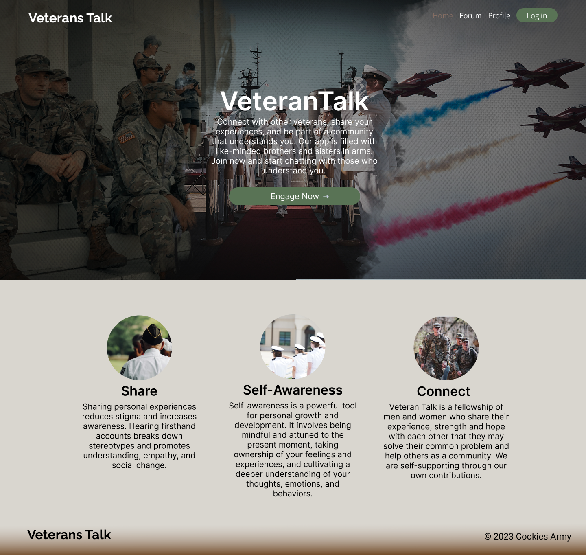
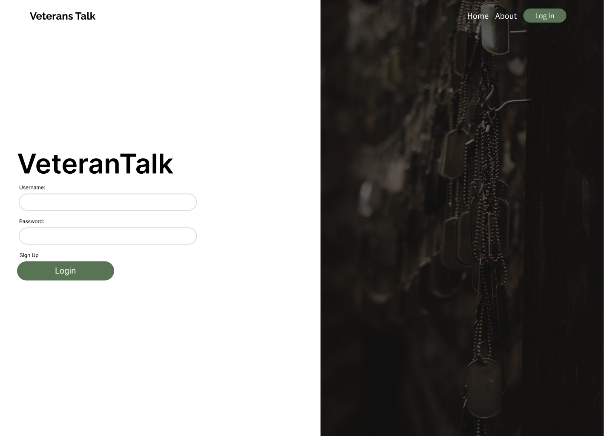
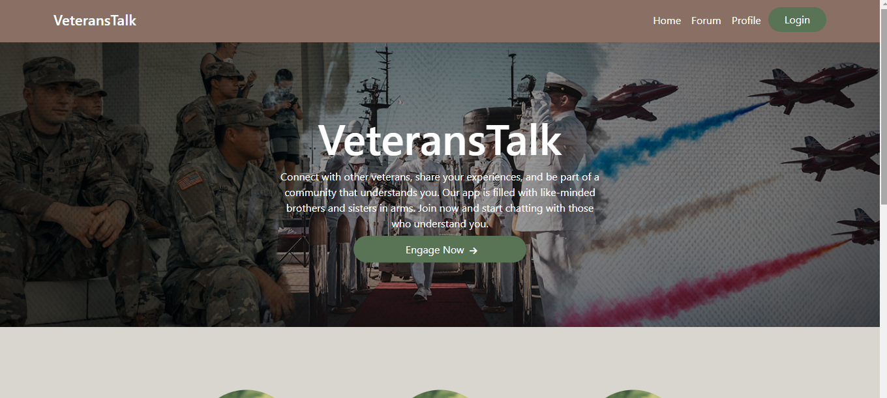
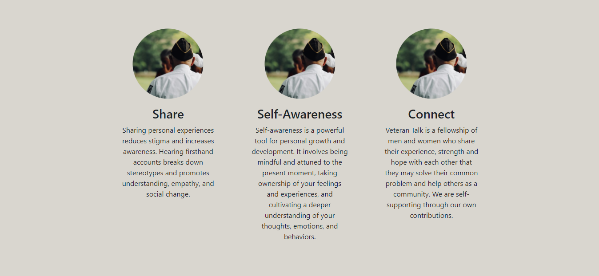
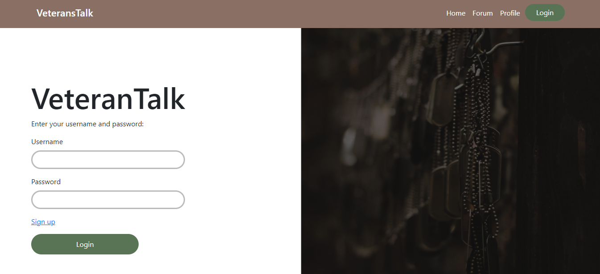
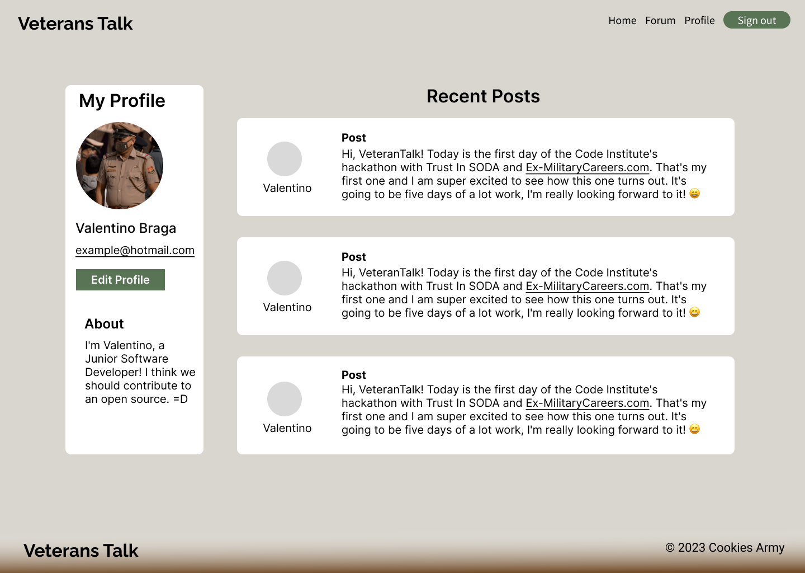
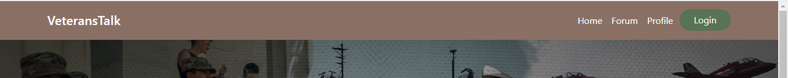
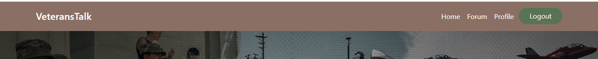
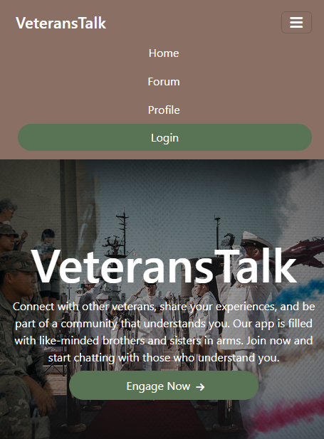

# VeteranTalk

VeteranTalk is a peer to peer online community platform where veterans of the armed forces can connect, share their stories anonymously and grow together towards mental wellness as they re-enter civilian life. For now, VeteranTalk operates as a forum but there is scope to introduce a live chat feature as the platform develops. Whether they come from the Army, Navy or Air Force, all veterans are welcome at VeteranTalk!


## [Live Site](https://team1-hackathon-april-2023.herokuapp.com)

## Contents

- [VeteranTalk](#veterantalk)
  - [Live Site](#live-site)
  - [Contents](#contents)
  - [UX Design](#ux-design)
    - [Strategy Plane](#strategy-plane)
    - [Scope Plane](#scope-plane)
    - [Structure Plane](#structure-plane)
      - [User Stories](#user-stories)
    - [Skeleton Plane](#skeleton-plane)
      - [Site Flow](#site-flow)
      - [Database Schema](#database-schema)
      - [Wireframes](#wireframes)
    - [Surface Plane](#surface-plane)
      - [Colour Scheme](#colour-scheme)
      - [Typography](#typography)
  - [Agile Development Process](#agile-development-process)
  - [**Current Features**](#current-features)
    - [**Navbar**](#navbar)
      - [Logged Out](#logged-out)
      - [Logged In](#logged-in)
      - [Mobile Navigation](#mobile-navigation)
    - [**Home Page**](#home-page)
    - [**About Page**](#about-page)
  - [**Future Development**](#future-development)
  - [Testing](#testing)
  - [Deployment](#deployment)
    - [Create repository](#create-repository)
    - [Setting up the Workspace (To be done locally via the console of your chosen editor)](#setting-up-the-workspace-to-be-done-locally-via-the-console-of-your-chosen-editor)
    - [Create Heroku App](#create-heroku-app)
    - [Creating Environmental Variables Locally](#creating-environmental-variables-locally)
    - [Setting up setting.py File](#setting-up-settingpy-file)
    - [Deploy the project](#deploy-the-project)
  - [**Technologies used**](#technologies-used)
  - [Credits](#credits)

## UX Design

### Strategy Plane

- Site Goal

  - The goal of the site is to encourage veterans of the armed forces to share the stories of the mental struggles they encountered while serving in order to help them understand and overcome these challenges, helping them maintain mental wellbeing as they readjust to civilian life.

- Target Audience

  - VeteranTalk is targeted at veterans who have recently left the armed forces and may be finding rejoining civilian life challenging, whether that be due to the sudden loss of their military community, navigating moving into a new civilian career or learning how to build healthy habits for mental wellbeing without the usual structure being in the military may have provided.

- Is there a need for this?

  - According to recent research by Dr. Alan Finnegan published by the British Medical Journal in 2022, 38% of veterans have a code for common mental health disorders on their primary healthcare records. The highest disorder prevalence was depression, followed by alcohol misues and anxiety. Lower disorder prevalence was seen across PTSD, dementia and substance misuse. 
  
  - According to research published by the British Legion in 2010, members of the ex-service community are more likely to experience depression and there is a prevalence of common mental disorders among 20% of the ex-service community. 
  
- While between 20% and 40% is quite big range of prevalence, other studies quote within a similar range and it is important changes in the trends of studies over time. Regardless of whether one leans toward the higher or lower end of this range, this is still a very large community experience some level of deterioration in their mental wellbeing. There is definitely a need for a service like this.

- Is the content relevant?

  - The content will be created by the site's community of users, thereby making it relevant to their needs as opposed to needs being assigned by a third party outside of this community.
  
- User Needs:

    - Users need to be able to maintain anonymity while accessing this community. In a panel discussion including veterans of the armed forces hosted by Trust in SODA,     Ex-Military Careers and Code Institute before the creation of this project, anxiety about being stigmatised was cited as an obstacle for veterans who may be   
    struggling with mental wellbeing to seeking help. 
    
    - Users need an accessible user interface in order to facilitate usage of the site. It is already a challenge for some people to discuss these issues, so it is
    vital not to add further restistance to this process with an interface that is difficult to use and hinders engagement with the community.

### Scope Plane

In order to manage the workload for each sprint, project features have been assigend differing levels of importance depending on their overall value towards reaching a minimum viable product (MVP).

- Must Have
The project must have:
    - A home page outlining purpose of the site and links to its main features.
    - Login/logout functionality allowing users to maintain anonymity if they so choose.
    - A forum where users can share and discuss their stories.
    - A database that stores user data securely.

- Should Have
    - Profile functionality where users can choose whether or not to share information about themselves, and where they can access their history of activity,     
    notifications etc.
    
- Could Have
    - Live chat feature.

### Structure Plane

#### User Stories

- Recent Veteran
  - As recent veteran, I can use VeteranTalk to chat with likeminded veterans so that we can share tips about how to build new routines that facilitate mental   
    wellbeing.
- Navy Veteran
  - As a navy veteran, I can use VeteranTalk to connect with others so that we can form a community in case we are struggling with loneliness after leaving our tight
    knit way of living on a ship or in barracks.
- Army Veteran
  - As an army veteran, I can use VeteranTalk to open up anonymously if I am struggling with mental health issues after leaving service. This way I can learn about how 
    common such issues are and be encouraged to find help without fear of being stigmatised.

### Skeleton Plane

#### Site Flow

Here is a wireframe of the planned site navigation.


The user should arrive at a home/landing page when first visiting the site. The page will have a brief description of the site's purpose and features. From the homepage, the user should be able to access the nav bar which will give them option of accessing the site's forum, their profile or a page where they can sign up, or sign in and out.


#### Database Schema

#### Wireframes

- 
- 

### Surface Plane

#### Colour Scheme


The site features navigational elements in green and brown, reflecting camouflage clothing that may be used in the armed forces.

Sections and elements that are text heavy use contrasting colours of black, white and charcoal to facilitate readability.


## Agile Development Process

We set up a repository with the main branch for the project on GitHub. All team members were invited to collaborate on this repository.

Tasks to work on were identified and added to the "Issues" feature of the GitHub repository. A project board was created and issues were categorised as "to do", "in progress", "to test" and "done" so project progress was clear.

The workflow procedure for each team member was as follows:

    -If you need help please ask.
    -Clone Adam’s project https://github.com/adammkeane/team1-hackathon-april-2023
    -Install dependencies: pip3 install -r requirements.txt
    -Create env.py
    -Create Feature branch and move to it: git checkout -b new-feature-branch-name
    -Check the branches to make sure you are on the correct branch: git branch.
    -Code, add, commit, push.
    -Create Pull Request from GitHub / let team know you did a PR in Slack.
    -Someone else reviews/approves PR, if OK merges the PR.


## **Current Features**

### **Home Page**



Our landing page features a hero image showing members of the army, the navy and the air force, letting people know that veterans of all kinds are welcome in this community.



As the user scrolls further down the home page, there is a section that briefly explains the purpose of the site.

### **Sign Up and Login/Logout Functionality**



Users have the option of signing up and thereafter logging in or out of Veterans Talk in order to use the forum feature.

### **Profile**



After deciding to sign up, users can create a profile with the option to share information about themselves should they choose. Their profile page will display a profile picture, a history of recent posts and the option to edit their profile should they chose.

### **Forum**


The forum is the main featre of Veterans Talk. It allows users to scroll through a paginated list of posts and contribute posts of their own. Users are also able to sort through posts by community, with "Army", "Navy", "Air Force" and "All Veterans" options available.

### **Comments**


Users can comment on posts in the forum and can view the history of past comments on a post.


#### **Logged Out**



When the user is logged out, the Login button appears in the navbar. A "Sign Up" option is also available on the page that the Login button navigates to.

#### **Logged In**



When the user is logged in, a Logout button appears, allowing them to log out.

### **Mobile Log In**


The login functionality is the same as above but appears differently on mobile screens.

#### **Mobile Navigation**



The authentication functionality is the same as above, however on smaller screens a burger menu appears, which drops down to reveal the navbar links.

###

## **Future Development**

There is scope for future development of this project with potential to add a live chat feature. There would need to be sufficient user traffic and demand to introduce such a feature. It would also require further measures to moderate its content.

## Testing

## Deployment

The live site was deployed to [Heroku](https://dashboard.heroku.com) using the following steps:

Below are the steps taken to deploy the site to Heroku and any console commands required to initiate it.

### Create repository

1. Create a new repository in GitHub, ticking the boxes for readme, and gitignore files, and clone it locally following [these instructions](https://docs.github.com/en/repositories/creating-and-managing-repositories/cloning-a-repository)
   - **_Note_** - If you are cloning my project, then you can skip all pip3 installs below and just run the following command in the terminal to install all the required libraries/packages at once:
     - `pip3 install -r requirements.txt`
   - **_IMPORTANT_** - If developing locally on your device, ensure you set up/activate the virtual environment (See below) before installing/generating the requirements.txt file. If you install the requirements before creating a virtual environment, all of the dependencies will be installed on your machine, create unecessary clutter and potentially affecting future projects using the same dependencies.

### Setting up the Workspace (To be done locally via the console of your chosen editor)

1. Open your project and `cd` into the workspace directory. You can type `ls` into the terminal to see what files are in your current working directory.
1. Create a virtual environment on your machine (Can be skipped if using gitpod):
   - python3 -m venv .venv
1. To ensure the virtual environment is not tracked by version control, add .venv to the .gitignore file.
1. Install the latest version of Django with
   - `pip3 install django`
1. Install gunicorn:
   - `pip3 install gunicorn`
1. Install supporting libraries:
   - `pip3 install dj_database_url psycopg2`
   - `pip3 install dj3-cloudinary-storage`
1. Create requirements.txt:
   - `pip3 freeze --local > requirements.txt`
1. Create a project in the current directory:
   - `django-admin startproject <PROJECT_NAME>` (in the case of this project, the project name was "tomsdrumlessons")
1. Create an app within the project:
   - `python manage.py startapp APP_NAME` (in the case of this project, I used several apps for different pages, such as 'home', 'bookings', 'reviews', so that I knew where the code for each page was located)
1. Add the new app(s) to the list of installed apps in setting.py, make sure to put them in quotation marks like all of the other installed apps, and seperate each one with a comma `,`
1. Migrate changes:
   - `python manage.py migrate`
1. Test server works locally:
   - `python manage.py runserver` (You should see the default Django success page)

### Create Heroku App

The below works on the assumption that you already have an account with [Heroku](https://id.heroku.com/login) and are already signed in.

1. Create a new Heroku app:
   - Click "New" in the top right-hand corner of the landing page, then click "Create new app."
1. Give the app a unique name:
   - Will form part of the URL (in the case of this project, I called the Heroku app toms-drum-lessons)
1. Select the nearest location:
   - For me, this was Europe.
1. Add Database to the Heroku app:
   - Navigate to the Resources tab of the app dashboard. Under the heading "Add ons," search for "Heroku Postgres" and click on it when it appears.
   - Select "Hobby Dev - Free" from the "plan name" drop-down menu and click "Submit Order Form."
1. From your editor, go to your projects settings.py file and copy the SECRET_KEY variable. Add this to the same name variable under the Heroku App's config vars.
   - left box under config vars (variable KEY) = SECRET_KEY
   - right box under config vars (variable VALUE) = Value copied from settings.py in project.

### Creating Environmental Variables Locally

1. In the top level of your directory, type `touch env.py` and add this to the .gitignore file.
1. From the Heroku app settings tab, click "reveal config vars" and copy the value of the variable DATABASE_URL. Add this value to a variable called DATABASE_URL in your create .env file:
   - `"DATABASE_URL"="databaseurl"`
1. From your projects settings.py file, copy the SECRET_KEY value and assign it to a variable called SECRET_KEY in your .env file
   - `"SECRET_KEY"="thisismysecretkey"` If you'd rather change this, you can generate a new one with [Djecrety](https://djecrety.ir/)
1. Add CLOUDINARY_URL variable to .env file:
   - Log into [cloudinary](https://cloudinary.com) and from the dashboard copy the API Environmental Variable. (Create a new account if you don't have one, this is where the static files will be stored.)
   - Add to `env.py` file like so:
     - `CLOUDINARY_URL"="PastedApiEnvironmentalVariable"` **Make sure to remove the `CLOUDINARY_URL=` from the pasted variable**

### Setting up setting.py File

1. At the top of your settings.py file, add the following snippet immediately after the other imports:

   ```python
       import os
       import dj_database_url
       if os.path.isfile('env.py'):
           import env.py
       SECRET_KEY = os.environ.get("SECRET_KEY")
       DEBUG = True
   ```

2. Delete the value from the setting.py DATABASES section and replace it with the following snippet to link up the Heroku Postgres server:

   ```python
   DATABASES = {
   'default': dj_database_url.parse(os.environ.get("DATABASE_URL"))
   }
   ```

3. Add Cloudinary libraries to the installed apps section of settings.py file:

   ```python
    INSTALLED_APPS = [
   …,
   'cloudinary_storage',
   'django.contrib.staticfiles',
   'cloudinary',
   …,
   ]
   (note: order is important)
   ```

4. Tell Django to use Cloudinary to store media and static files by placing this snippet under the comments indicated below:

```python
    # Static files (CSS, JavaScript, Images)
    # https://docs.djangoproject.com/en/3.2/howto/static-files/
    STATIC_URL = '/static/'
    STATICFILES_STORAGE = 'cloudinary_storage.storage.StaticHashedCloudinaryStorage'
    STATICFILES_DIRS = [os.path.join(BASE_DIR, 'static/')]
    STATIC_ROOT = os.path.join(BASE_DIR, 'staticfiles')
    MEDIA_URL = '/media/'
    DEFAULT_FILE_STORAGE = 'cloudinary_storage.storage.MediaCloudinaryStorage'
```

1. Under the line with BASE_DIR, link templates directly in Heroku via settings.py:

   - `TEMPLATES_DIR = os.path.join(BASE_DIR, 'templates')`

1. Within the TEMPLATES array, add `'DIRS':[TEMPLATES_DIR]` like the below example:

```python
   TEMPLATES = [
       {
           …,
           'DIRS': [TEMPLATES_DIR],
           …,

        },
   ]
```

1. Add allowed hosts to settings.py:

   - `ALLOWED_HOSTS = ["PROJECT_NAME.herokuapp.com", "127.0.0.1"]`

2. Create a Procfile at the top level of the file structure and insert the following:

   - `touch Procfile` (the capital P is important!)
   - Inside that file, add `web: gunicorn PROJECT_NAME.wsgi`

3. Make an initial commit and push the code to the GitHub Repository.
   - `git add .`
   - `git commit -m "Initial deployment"`
   - `git push`

### Deploy the project

1. For the live project, ensure that `DEBUG = False` in settings.py
1. Go to your Heroku project dashboard, and click on the 'Deploy' tab
1. Next to 'Deployment method', choose the right one for you. I deplyed via Github so the instructions below are related to that.
1. Click on the Github icon 'connect to GitHub'
1. Login to your GitHub account if needed, then search for the repository you want to connect the site to.
1. When it shows up below, click 'connect'.
1. Next to 'Automatic deploys' choose the branch you'd like to deploy from. In most cases this will be 'main'.
1. Click 'Enable Automatic Deploys' if you would like Heroku to deploy your code everytime you push it to the above branch.
1. If you prefer to deploy manually, scroll down to 'Manual deploy', choose your branch, and click 'Deploy Branch'
1. Scroll back to the top, and once it's finished deploying, click 'Open app', on the top right side.

Congratualations, you've deployed your site!

## **Technologies used**

- Python
  - All packages used can be found in the [requirements.txt](requirements.txt) file
- [Django](https://www.djangoproject.com/) - The Model View Template framework used to build the project and apps.
  - [allauth](https://django-allauth.readthedocs.io/en/latest/installation.html) was used for the login/out functionality and templates.
- [Heroku](https://dashboard.heroku.com)
  - for deployment and hosting.
- [Heroku Postgres](https://elements.heroku.com/addons/heroku-postgresql)
  - used for the database.
- HTML
  - Used for the template structures.
- CSS
  - Used to style the markup.
-Bootstrap
  - Used to to style the markup and general layouts.
- Javascript
  - Custom use.
-SQLite
  - Used to handle user data.
## Credits

- [Figma](https://www.figma.com/) for creating the wireframes
- VS Code for the text editor
- [Bootstrap](https://getbootstrap.com/docs/4.6/getting-started/introduction/)
  - Version 4.6.1, CSS framework for building a responsive front end, quickly. Comes with built-in javascript for features like the collapsable navbar, and accordion FAQs section.
- [Cloudinary](https://cloudinary.com/)
  - Used to store static files and media.
- [GitHub](https://github.com/)
  - Used for version control throughout the build process
  - GitHub Projects used to organise user stories and tasks.
- [VS Code](https://code.visualstudio.com/)
  - Text editor used to write the code and store the project locally.
- [Lucid Charts](https://lucid.app/)
  - Used for the site flow and ERD diagrams.
- [Coolers](https://coolors.co)
  - for the site colour scheme.
- [Google Fonts](https://fonts.google.com/)
- [Favicon Generator](https://favicon.io/favicon-generator/)
 - Used to create the favicon.
- General References
  - Stack Overflow
  - GeeksForGeeks
  - Django docs
  - Bootstrap Docs
  - W3Schools
  
